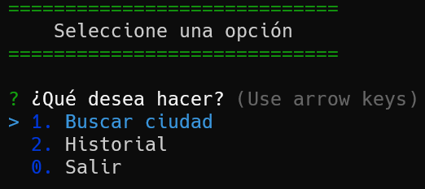
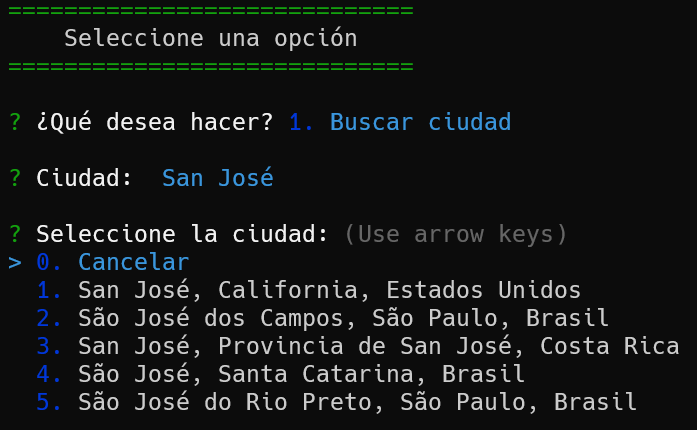
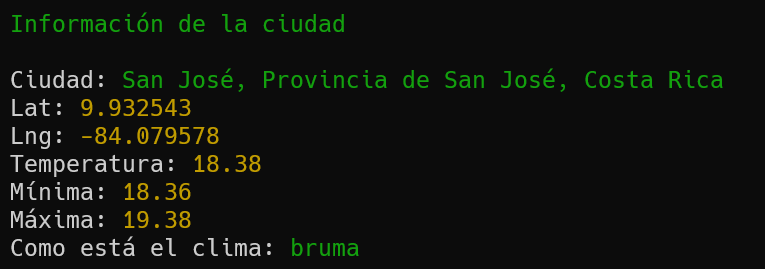
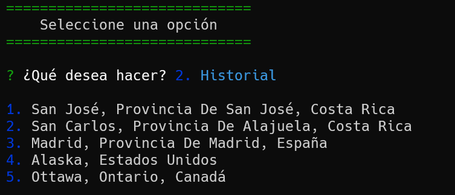

# Clima App

Aplicación en consola usando Node.js para consultar el clima actual en una ciudad.

> ### Menú

> ### Buscar Ciudad

> ### Información del clima

> ### Historial

> ### How to clone

`git clone https://github.com/derianrddev/node-tareas-hacer.git`
 

> ### Install dependencies

`npm install`